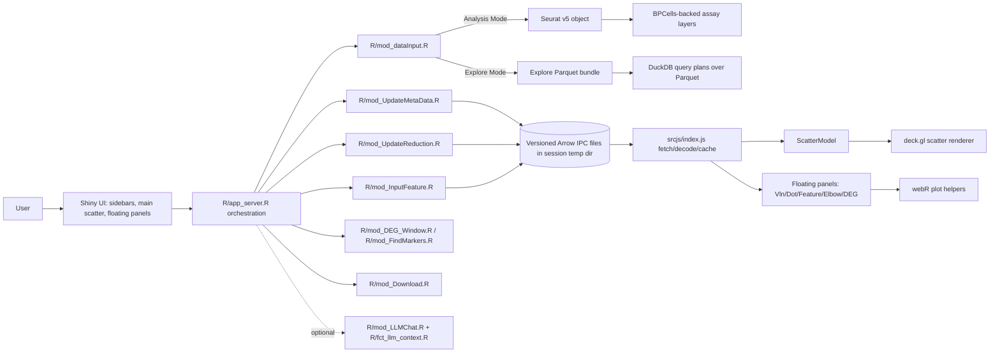

# Architecture Patterns

**Domain:** R/Shiny single-cell RNA-seq analysis and visualization app  
**Project:** scSpotlight  
**Researched:** 2026-06-16  
**Overall confidence:** HIGH — grounded in current repository docs and implementation files.

## Recommended Architecture

scSpotlight should remain a **single Shiny runtime with two explicit backend modes** and one shared browser visualization runtime:



The central architectural rule is: **R owns persistent analysis state; JavaScript owns interactive rendering state; Arrow IPC files are the large-payload boundary.** Do not blur this by passing full R objects to workers, mirroring Analysis Mode assays into DuckDB, or sending large JSON tables to the browser.

## Component Boundaries

| Component | Responsibility | Communicates With | Boundary Rule |
|-----------|----------------|-------------------|---------------|
| `R/app_ui.R` | Static UI shell: left/right sidebars, main scatter slot, floating panel host/rail | Shiny modules, `srcjs/index.js` DOM hooks | UI structure only; do not embed large data or analysis logic here. |
| `R/app_server.R` | Session orchestration, temp directories, resource path, reactive indicators, mode gating | All server modules, JavaScript via Shiny inputs/custom messages | Coordinates flow; avoid direct data extraction except compact context assembly. |
| `R/mod_dataInput.R` | Input validation/import, mode-specific file acceptance, Seurat/BPCells or Explore bundle initialization | Backend helpers, `seuratObj` reactive, update indicators | Analysis Mode may process/derive missing state; Explore Mode only accepts processed `.explore-parquet.zip`. |
| `R/fct_bpcells_backend.R` | Backend-agnostic API plus Seurat/BPCells implementation: features, metadata, reductions, expression, bundles, h5ad | Server modules, Explore helpers | Public internal seam: modules should call `get_backend_*()` / `prepare_backend_*()` helpers rather than branching everywhere. |
| `R/fct_explore_bundle.R` | Explore Parquet bundle schema, validation, DuckDB query plans, chunked IPC writers | Backend seam, data input, conversion/download | Explore runtime should pass paths/query plans into async work, not live bundle data frames. |
| `R/mod_UpdateMetaData.R` | Full metadata transfer and column-scoped metadata patches | `seuratObj`, `metaUpdateIndicator`, `metaPatchRequest`, JS `meta_ready` / `meta_patch_ready` | Prefer patches for column changes; full metadata transfer only on dataset or broad metadata changes. |
| `R/mod_UpdateReduction.R` | Reduction selection, PCA stdev transfer, reduction prefetch/cache negotiation | Backend transfer helpers, JS reduction cache | Prefetch conservatively for large cell counts; active reduction must render before readiness. |
| `R/mod_InputFeature.R` | Feature list UI, expression extraction queue, expression IPC notification | Backend expression transfer, JS expression cache/sparklines | One queued expression transfer at a time per session to avoid overlapping BPCells memory peaks. |
| `R/mod_FindMarkers.R` / DEG window | Analysis-mode differential expression workflow | Seurat object, floating DEG UI, optional LLM summaries | Server-side analysis/result rendering; not available as Explore Mode mutation. |
| `R/mod_Download.R` | Export current object/session state to metadata, Explore Parquet, BPCells bundle, h5ad, or Rds | Backend bundle/export helpers | Default to portable low-memory formats; warn before standard RDS materialization. |
| `srcjs/index.js` | Browser integration hub: Shiny message handlers, IPC fetch/decode/cache, floating panel state, scatter replacement | Shiny server, `deckScatter`, webR, floating plots | Keep global state small; version caches; make transfer failures visible. |
| `srcjs/modules/deckScatter.js` | Main WebGL scatter controller, legends, selection, relayout, renderer lifecycle | `ScatterModel`, deck.gl, lasso/scatter helpers | Main 1M+ path must stay WebGL/deck.gl and TypedArray-backed. |
| `srcjs/modules/scatter/scatterModel.js` | Client-side plot data derivation from decoded metadata/reduction/expression | `deckScatter.js` | Pure data derivation where possible; main expression mode uses first selected gene only. |
| `srcjs/modules/scatter/scatterLayout.js` | Adaptive split-panel grid sizing | `deckScatter.js` | Multi-panel layouts must remain bounded and scrollable for high-cardinality split views. |
| `srcjs/modules/floatingPlots.js` | Floating panel windowing, rail buttons, drag/resize/clamp/refresh events | `srcjs/index.js` refresh callbacks | Owns panel chrome only; plot data/rendering logic stays in `index.js`/webR/server modules. |
| `srcjs/modules/featureSparkLine.js` | Feature sparkline list and selected-feature UI state | JS expression data, Shiny `selectedFeatures` input | Selection changes should update state/status, not automatically rerender expensive floating plots. |
| `R/mod_LLMChat.R` / `R/fct_llm_context.R` | Optional server-side assistant with compact read-only summaries | `app_server` analysis context, ellmer/shinychat | Disabled by default; never expose full cell-level data, local paths, secrets, or raw matrices. |

## Data Flow

### Initial Session Setup

1. `R/app_server.R` creates a session temp directory with `reduction/`, `meta/`, `expr/`, and `backend/` subdirectories.
2. `addResourcePath("data", tempDir)` exposes only session-generated transfer files to the browser.
3. The loaded backend object is stored in `seuratObj`, but this can be either:
   - a Seurat object with BPCells-backed assay layers in Analysis Mode, or
   - a `scspotlight_explore_bundle` descriptor in Explore Mode.
4. Reactive counters (`metaUpdateIndicator`, `reductionUpdateIndicator`, `geneUpdateIndicator`, `scatterUpdateIndicator`, `plotRefreshIndicator`) trigger specific transfer or redraw paths.

### R-to-JS Browser Transport

Large browser payloads follow one contract:

```text
R backend source
  → backend transfer helper builds versioned output path/query plan
  → chunked Arrow IPC writer writes file under session temp dir
  → session$sendCustomMessage(type = "*_ready", message = file/version metadata)
  → srcjs/index.js fetches /data/<kind>/<file>
  → Arrow IPC decoder returns TypedArrays / compact metadata objects
  → ScatterModel/deckScatter/floating panels consume decoded data
```

| Payload | R Producer | Message | Browser Consumer | Client State |
|---------|------------|---------|------------------|--------------|
| Metadata | `mod_UpdateMetaData.R` via backend metadata transfer | `meta_ready` | `parseMetaFromArrow()` then `reglElementData.updateCellMetaData()` | Compact metadata object, categorical dictionaries, cached expansions/levels |
| Metadata patch | `mod_UpdateMetaData.R` with `cols` | `meta_patch_ready` | `updateCellMetaDataPatch()` | Merged column patch; affected panels marked dirty |
| Reduction | `mod_UpdateReduction.R` | `reduction_ready`, `reductions_ready`, `reduction_cached` | `decodeReductionBuffer()` then `updateReductionData()` | Hot decoded reduction plus cold IPC cache keyed by version/reduction |
| PCA stdev | `mod_UpdateReduction.R` | `pca_ready` | `updatePcaStdev()` | Typed stdev vector for client-side ElbowPlot |
| Expression | `mod_InputFeature.R` | `expr_ready`, `expr_cached` | `decodeArrowIPC()` then `updateExpressionData()` | Per-gene Float32Arrays plus cold IPC cache keyed by version/assay/gene |
| Plot refresh | `mod_mainClusterPlot_server()` | `reglScatter_plot` | Atomic render replacement in `srcjs/index.js` | New scatter DOM/deck instance, previous restored on failure |

Use this transport for any new large payload. Avoid JSON for full metadata, reductions, expression vectors, marker matrices, or cell-level selections beyond explicit user-selected cell id lists.

## Analysis Mode vs Explore Mode Backend Differences

### Analysis Mode

Analysis Mode is the full mutable analysis workflow launched by `scSpotlight::run_app()`.

**Backend source of truth:** Seurat v5 object in `seuratObj`, with assay layers converted or maintained as BPCells-backed on-disk matrices.

**Allowed responsibilities:**

- Load Seurat `.Rds`, `.h5ad`, BPCells bundles, or compressed 10x-style matrices.
- Normalize data when needed and possible.
- Derive missing HVGs/PCA/neighbors/clusters/UMAP for processable inputs.
- Mutate metadata through workflows such as cell cycling and rename clusters.
- Run DEG analysis and export mutable analysis results.
- Export BPCells bundles, Explore Parquet bundles, h5ad, standard RDS, and metadata.

**Data access rules:**

- Metadata: `object[[]]` through `get_backend_metadata()`.
- Reductions: `Embeddings(object[[reduction]])` through `get_backend_reduction()`.
- Expression: selected assay/layer via BPCells/Seurat layer access through `prepare_backend_expression_transfer()`.
- Expression transfer should remain queued and in-process for BPCells-backed Seurat objects; do not push live BPCells/Seurat objects into multisession workers.

### Explore Mode

Explore Mode is read-only and launched by `scSpotlight::run_app(runningMode = "explore")`.

**Backend source of truth:** processed Explore Parquet bundle (`scspotlight_explore_parquet_bundle`) with manifest, cells, metadata, features, reductions, optional PCA stdev, and sparse expression blocks.

**Allowed responsibilities:**

- Accept only `.explore-parquet.zip` as the user-facing input format.
- Validate manifest and required Parquet files.
- Serve metadata/reductions/expression via DuckDB over Parquet and Arrow IPC transfer files.
- Allow browser-side exploration state, but not persistent mutation of the bundle unless a future export contract is explicitly added.

**Data access rules:**

- Metadata: stream `metadata.parquet` ordered by `.scspotlight_cell_idx`, adding client-facing `cells` ids in the IPC payload.
- Reductions: stream `reductions/<name>.parquet`, selecting first two components as `X`/`Y`.
- Expression: locate feature block from `features.parquet`, query sparse long rows with DuckDB, write dense Float32 expression IPC chunks incrementally.
- Futures should receive paths/query plans, not live bundle objects or eager data frames.

## Scatter and Floating Panel Interaction Model

The main scatter and floating panels share decoded client-side data but have different refresh semantics.

### Main Scatter

- `srcjs/index.js` owns Shiny message handling and creates atomic render replacements.
- `reglScatterCanvas` in `deckScatter.js` owns DOM containers, deck.gl lifecycle, legends, relayout, lasso, selection, and adaptive render parameters.
- `ScatterModel` derives plot mode, panel count, points, colors, selected cells, and panel titles from decoded reduction/metadata/expression.
- Main expression coloring uses **only the first selected gene**. Multiple selected genes are retained for floating DotPlot/FeaturePlot, not combined in the main scatter.
- Multi-panel modes must treat every panel as first-class for lasso hit-testing, highlights, selection badges, legends, and relayout.
- `scatterLayout.js` should remain the place for split-panel grid rules and high-cardinality layout tuning.

### Feature Sparkline List

- `mod_InputFeature.R` requests expression transfers and sends `createSparkLine` before/while expression is loading.
- `featureSparkLine.js` renders loading/ready/checked states and sends `selectedFeatures` to Shiny.
- The first selected feature is visually emphasized because it controls the main scatter expression layer.
- Selection changes dispatch `scspotlight:featurePlotSelectionChanged`; this marks floating plots stale and refreshes statuses/options, but should not auto-run expensive DotPlot/FeaturePlot renders.

### Floating Panels

| Panel | Runtime | Refresh Contract | Data Source |
|-------|---------|------------------|-------------|
| VlnPlot | Browser webR canvas render | Menu-driven; redraws immediately on menu selection; redraws on resize after first render | Current `group.by`, numeric metadata columns, selected genes with expression |
| DotPlot | Browser webR canvas render | Explicit plot button; redraws on resize only after first render; supports custom group order | Current `group.by`, selected genes, expression arrays |
| FeaturePlot | Browser webR canvas render | Explicit plot button; redraws on resize only after first render; unavailable during module-score mode | Current reduction and selected genes' expression arrays |
| ElbowPlot | Browser canvas render | Auto-refresh on open, resize, and PCA stdev transfer | PCA stdev vector from `pca_ready` |
| DEG Analysis | Server-side Shiny outputs in floating window | Runs only on explicit DEG action | Analysis Mode Seurat object and selected `group.by` |

`floatingPlots.js` owns panel mechanics: rail buttons, opening/closing, z-index focus, drag, top-right resize, bounds clamping, left-sidebar rail sync, and refresh event dispatch. It should not acquire data-access responsibilities.

## Optional LLM Assistant Placement

The LLM assistant sits **outside the core plotting/data-transfer runtime**.

```text
Core runtime state → compact reactive context → optional LLM module → aggregated read-only tools → provider
```

Architectural rules:

- Keep `enableLLM = FALSE` as the default.
- Keep `ellmer` and `shinychat` optional (`Suggests`), not required startup dependencies.
- Mount UI only through an explicit future UI decision; current implementation can run server wiring without changing visible UI.
- Use `build_llm_analysis_context()` for compact app state: backend type, counts, selected assay/reduction, group/split choices, selected features, metadata column names, and DEG availability.
- Use registered read-only tools for aggregated summaries only: current app state, group counts, and top DEG rows.
- Never send full metadata, full expression, reductions, local paths, credentials, or raw files to the provider.
- MCP-backed tooling should remain deferred until summary-only helper contracts and runtime guardrails are stable.

## Patterns to Follow

### Pattern 1: Backend-Agnostic Module Calls

**What:** Server modules should call backend seam functions instead of branching on Seurat vs Explore internals.

**When:** Any module needs features, metadata, reductions, expression, cell counts, assays, or PCA stdev.

**Example:**

```r
features <- get_backend_features(seuratObj(), assay = inputData$selectedAssay())
meta <- get_backend_metadata(seuratObj(), cols = c("seurat_clusters"))
reduction <- get_backend_reduction(seuratObj(), reduction = "umap")
```

### Pattern 2: Versioned IPC Transfer Handshake

**What:** R writes a versioned Arrow IPC file and sends only metadata about that file; JS fetches, decodes, caches, and acknowledges readiness through Shiny inputs.

**When:** Any large payload crosses R-to-browser.

**Example:**

```r
transfer <- prepare_backend_reduction_transfer(
  seuratObj(),
  reduction_name = input$reduction,
  dir_path = file.path(session$userData$tempDir, "reduction"),
  reduction_version = reductionUpdateIndicator()
)
result <- write_backend_reduction_transfer(transfer)
session$sendCustomMessage(type = "reduction_ready", message = result)
```

### Pattern 3: Reactive Indicators as Dependency Edges

**What:** Use monotonic `reactiveVal()` counters to trigger specific transfer or redraw work.

**When:** Object state changes, metadata changes, reduction changes, gene list changes, or view-only scatter settings change.

**Rule:** Data transfer completion should drive `plotRefreshIndicator`; view-only settings should drive `scatterUpdateIndicator`. Avoid making the plot renderer directly depend on full metadata/reduction objects.

### Pattern 4: Explicit-Action Expensive Floating Plots

**What:** Expensive browser-side webR plots should mark themselves stale on upstream state changes, then wait for explicit user action unless the already-rendered panel is being resized.

**When:** DotPlot and multi-gene FeaturePlot.

**Why:** Prevents repeated webR work during feature selection and keeps user context stable.

## Anti-Patterns to Avoid

### Anti-Pattern 1: Reintroducing a Mirrored DuckDB Runtime for Analysis Mode

**What:** Copying Seurat/BPCells assay state into DuckDB tables for normal Analysis Mode queries.

**Why bad:** Duplicates state, increases memory and synchronization burden, and conflicts with current Seurat/BPCells source-of-truth decision.

**Instead:** Use direct Seurat/BPCells access through backend seam helpers; reserve DuckDB for Explore Parquet query plans.

### Anti-Pattern 2: Full Object Transfer to Futures

**What:** Passing live Seurat, BPCells, or Explore bundle objects into background worker processes for large extraction tasks.

**Why bad:** Can copy huge state, break BPCells/HDF5 assumptions, and exceed Docker/session memory limits.

**Instead:** For Explore, pass paths/query plans. For Analysis expression, keep queued in-process chunked writers. Use promises around file writing only where safe.

### Anti-Pattern 3: JSON Large Payloads

**What:** Sending metadata tables, reductions, expression vectors, or large marker matrices through `sendCustomMessage()` as JSON.

**Why bad:** JSON inflates payloads and forces high browser/server memory churn.

**Instead:** Write Arrow IPC and send only file/version metadata.

### Anti-Pattern 4: Auto-Rerendering Floating Plots on Every Selection

**What:** Triggering DotPlot/FeaturePlot webR renders whenever feature selection changes.

**Why bad:** Causes expensive, surprising rerenders during multi-gene selection workflows.

**Instead:** Mark stale, update status, and wait for explicit plot action.

### Anti-Pattern 5: Letting LLMs Touch Raw Analysis State

**What:** Giving providers full data frames, expression matrices, reductions, file paths, API keys, or open-ended tools.

**Why bad:** Violates privacy/security constraints and can move huge data out of process.

**Instead:** Keep summary-only, read-only, capped helper tools server-side.

## Suggested Build Order / Dependency Order for Future Work

Use this order for future phases so low-level contracts stabilize before UI expands:

1. **Backend contract and schema first**
   - Define or migrate Seurat/BPCells and Explore bundle helper contracts.
   - Add schema/version handling before new UI depends on the data.
   - Verify low-memory extraction paths and chunk sizes.

2. **Transfer path second**
   - Add versioned Arrow IPC writers/readers and browser message handlers.
   - Include stale-cache handling, visible transfer errors, and readiness acknowledgements.
   - Add partial-transfer support if changes are column- or feature-scoped.

3. **Client data model third**
   - Extend `ScatterModel` or dedicated JS state helpers to represent new data compactly.
   - Use TypedArrays/dictionary-style categorical structures.
   - Avoid DOM-coupled data derivation.

4. **Rendering and interaction fourth**
   - Add deck.gl layers, scatter model modes, floating canvas renders, or server-side outputs only after data contracts are stable.
   - Verify multi-panel layout, lasso, selection mirroring, resize behavior, and high-cardinality split cases.

5. **Mode-specific UI fifth**
   - Gate Analysis-only features in `app_ui.R` and `app_server.R`.
   - Keep Explore Mode read-only and constrained to Explore artifacts.

6. **Exports/conversion sixth**
   - Add download/conversion support after runtime read paths are stable.
   - Prefer self-identifying bundle formats and avoid materializing BPCells layers unless explicitly requested.

7. **Optional assistants last**
   - Build compact summaries and tests before mounting LLM UI.
   - Keep assistant capability behind feature flags and summary-only tools.

## Scalability Considerations

| Concern | At 100 users/cells-scale small | At 10K–500K cells | At 1M+ cells |
|---------|--------------------------------|-------------------|--------------|
| Backend storage | Standard Seurat object works | Convert layers to BPCells | BPCells required; avoid dense `scale.data` and graph persistence |
| Metadata transfer | Full IPC acceptable | Full IPC plus patches | Prefer patches for column changes; cache client expansions/levels |
| Reduction transfer | Prefetch several reductions | Prefetch limited set | Prefetch active reduction only or very conservatively |
| Expression transfer | Multiple quick feature loads acceptable | Queue per session | Queue one feature at a time; chunk BPCells/DuckDB reads into Float32 IPC |
| Browser rendering | deck.gl still acceptable | Adaptive point size/opacity | WebGL mandatory; disable/limit expensive picking above thresholds if needed |
| Split panels | Simple grid | Balanced grid | Adaptive minimum panel size and scrollable deck surface |
| Floating plots | webR renders are fine | Explicit action for expensive plots | Avoid auto-renders; consider downsampling/summary approaches for new plot types |
| Downloads | RDS acceptable | Prefer BPCells/Explore bundles | Avoid standard RDS unless user confirms materialization risk |

## Sources

- `.planning/PROJECT.md`
- `AGENTS.md`
- `DEVELOPMENT.md`
- `README.md`
- `DESCRIPTION`
- `R/app_server.R`
- `R/app_ui.R`
- `R/fct_bpcells_backend.R`
- `R/fct_explore_bundle.R`
- `R/mod_dataInput.R`
- `R/mod_UpdateMetaData.R`
- `R/mod_UpdateReduction.R`
- `R/mod_InputFeature.R`
- `R/mod_Download.R`
- `R/mod_FindMarkers.R`
- `R/mod_LLMChat.R`
- `R/fct_llm_context.R`
- `srcjs/index.js`
- `srcjs/modules/deckScatter.js`
- `srcjs/modules/scatter/scatterModel.js`
- `srcjs/modules/scatter/scatterLayout.js`
- `srcjs/modules/floatingPlots.js`
- `srcjs/modules/featureSparkLine.js`
