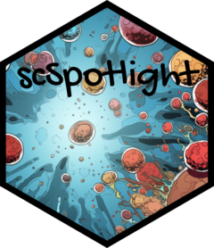

<!-- README.md is generated from README.Rmd. Please edit that file -->

# scSpotlight <a href="https://obenno.github.io/scSpotlight/"></a>

<!-- badges: start -->

<!-- badges: end -->

The goal of scSpotlight is to simplify your single cell analysis and
easily annotate your dataset with curated cell type markers.
`scSpotlight` is built on [shiny](https://shiny.posit.co/),
[Seurat](https://satijalab.org/seurat/) and
[regl-scatterplot](https://github.com/flekschas/regl-scatterplot).


## Installation

You can install the development version of scSpotlight from
[GitHub](https://github.com/) with:

``` r
# install.packages("devtools")
devtools::install_github("obenno/scSpotlight")
```

or a much faster installation with `pak`:

``` r
# install.packages("pak")
pak::pkg_install("obenno/scSpotlight")
```

## Docker

To pull the latest image from the command line

    docker pull registry-intl.cn-hangzhou.aliyuncs.com/thunderbio/scspotlight:0.0.2

To run the app on `port:8081`, please use the command below:

    docker run -p 8081:8081 registry-intl.cn-hangzhou.aliyuncs.com/thunderbio/scspotlight:0.0.2 Rscript -e 'scSpotlight::run_app(options = list(port=8081, host="0.0.0.0", launch.browser = FALSE), runningMode="processing")'
