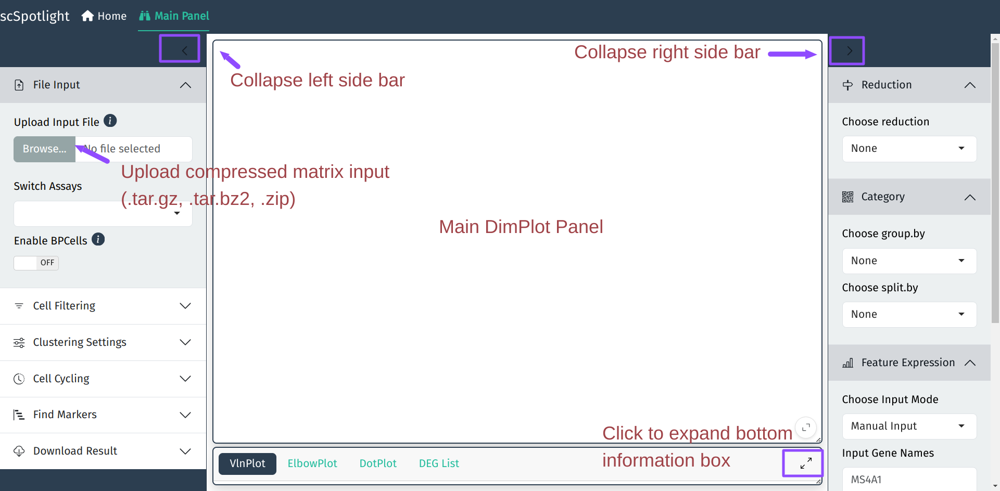
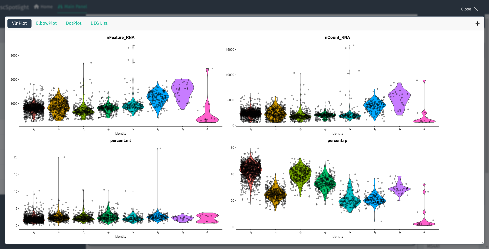
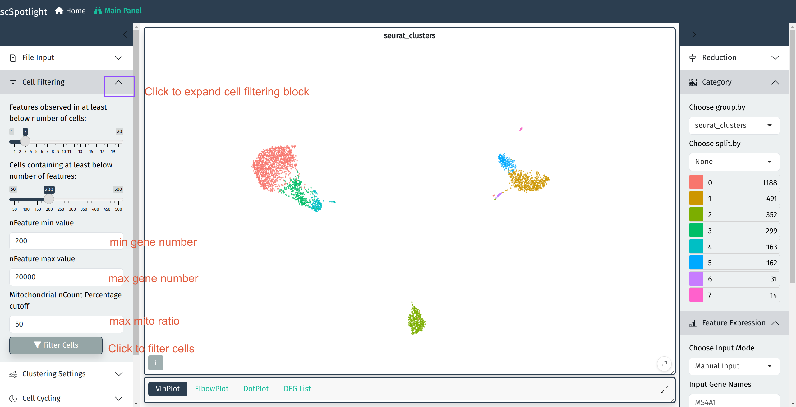
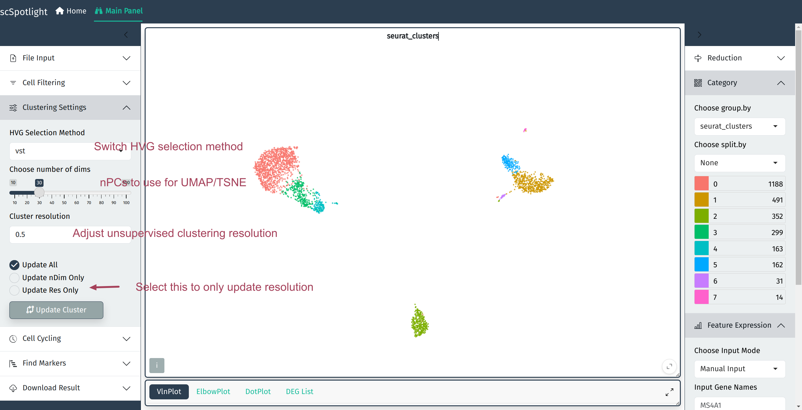
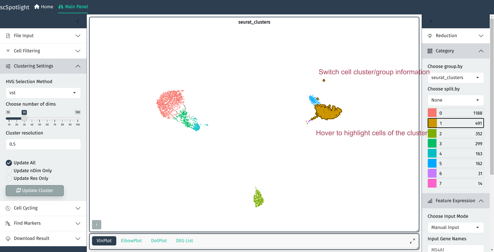
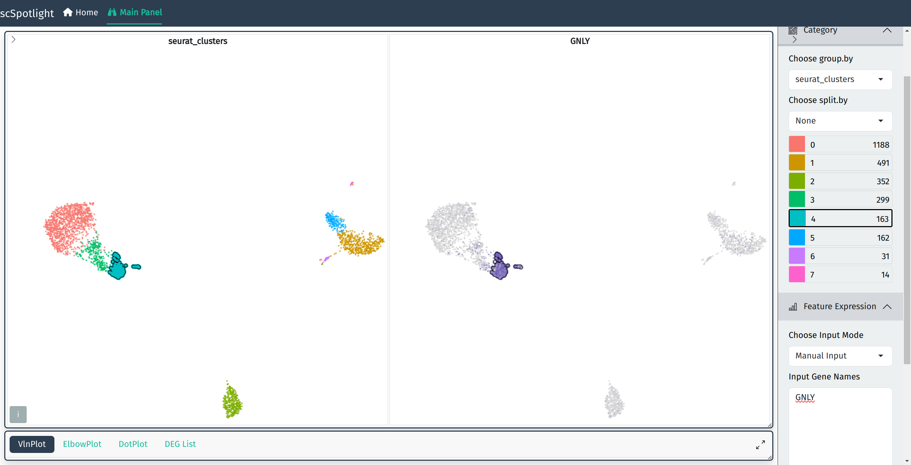
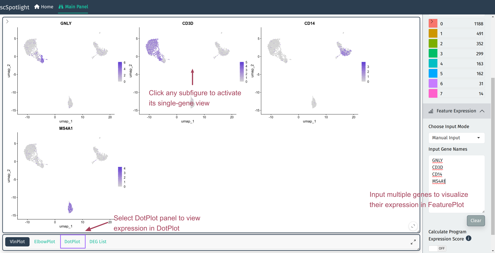
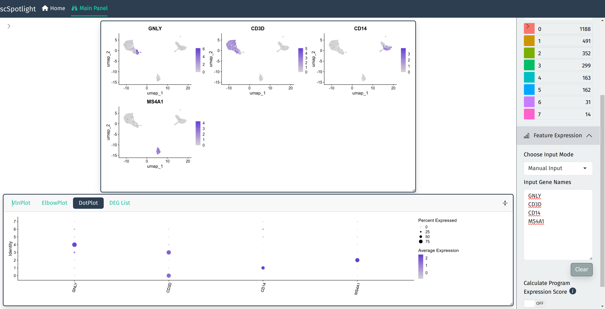

```{r, include = FALSE}
knitr::opts_chunk$set(
  collapse = TRUE,
  comment = "#>"
)
```

## Seurat Analysis Workflow

`scSpotlight` uses the Seurat standard single cell analysis workflow, we recommend
new users going through their [pbmc3k tutorial](https://satijalab.org/seurat/articles/pbmc3k_tutorial) 
to better understand each processing step. The demonstration dataset used is a 2,700 
Peripheral Blood Mononuclear Cells (PBMCs) sample made publicly available by 10X Genomics. 
The matrix could be downloaded [here](https://cf.10xgenomics.com/samples/cell/pbmc3k/pbmc3k_filtered_gene_bc_matrices.tar.gz).

A typical seurat analysis workflow is like below:

```{r, echo=FALSE}
knitr::include_graphics("images/seurat_standard_workflow.png")
```

## Invoke App

To start using scSpotlight, please use the command below and access the app via: `127.0.0.1:8081`

```R
scSpotlight::run_app(options = list(port = 8081, host = "0.0.0.0"))
```

The default mode of app is `processing`. User could also change mode to `viewer`, which will only allow illustrating
dataset and querying gene expressions:

```R
scSpotlight::run_app(options = list(port = 8081, host = "0.0.0.0"), runningMode = "viewer")
```

If one needs to load a very large dataset, use `dataDir` parameter to mount data directory and load `Rds` file directly.

```R
scSpotlight::run_app(options = list(port = 8081, host = "0.0.0.0"), runningMode = "viewer", dataDir = "/path/to/data_directory")
```

## Main Panel

Main panel of `scSpotlight` will be like:

```{r, echo=FALSE}

```

## Input Files

Under the "processing" mode, `scSpotlight` supports compressed file containing typical 10X 
cellranger output ([Matrix Market Format](https://math.nist.gov/MatrixMarket/formats.html)):

```
$ tar -tvf PBMC_demo.tar.gz
drwxrwxr-x xzx/xzx           0 2024-01-11 21:11 PBMC_demo/
-rw-r--r-- xzx/xzx    67972057 2024-01-11 21:10 PBMC_demo/matrix.mtx.gz
-rw-r--r-- xzx/xzx      294722 2024-01-11 21:10 PBMC_demo/features.tsv.gz
-rw-r--r-- xzx/xzx       46443 2024-01-11 21:10 PBMC_demo/barcodes.tsv.gz
```

and processed Seurat object `seurat_processed.Rds` saved by [Seurat::SaveSeuratRds()].

If using compressed matrix file as input, scSpotlight will process
data after loading **without cell filtration** and the dimension reduction will be shown.

## Filter Cells

scSpotlight will automatically illustrate nGene (nFeature\_RNA), nUMI (nCount\_RNA), mitochondrial
gene UMI percentage (percent.mt) and ribosomal protein gene UMI percentage (percent.rp) for each 
cell in VlnPlot panel. One could inspect the distribution and roughly evaluate the library quality. 
User could discard cells with too few or too many features detected and dying cells with 
high mitochondrial UMI percentage by adjusting parameters in the "Cell Filtering" block. The filtration
step will also update highly variable genes (HVGs), the dimension reduction and the 
cell clustering result.

```{r, echo=FALSE, fig.cap="VlnPlot summarizes nGene, nUMI, percent.mt and percent.rp distribution"}
knitr::include_graphics("images/vlnplot_1.png")
```

```{r, echo=FALSE, fig.cap="VlnPlot full screen"}

```

```{r, echo=FALSE, fig.cap="Cell filtration block"}

```

## Highly variable features and Clustering

User will be able to adjust highly variable gene selection method and parameters related to
unsupervised clustering.

```{r, echo=FALSE, fig.cap="Clustering setting block"}

```

## Cell identity (groups) visualization

```{r, echo=FALSE, fig.cap="Select cell identity"}

```

## Gene expression

Input gene symbol to view its expression aside of the original cluster view

```{r, echo=FALSE, fig.cap="Single gene expression"}

```
Input multiple genes to view all of them via Seurat::FeaturePlot(), and
click anyone of the subfigures to acitvate single gene view.

```{r, echo=FALSE, fig.cap="Multiple gene expression"}

```

Or view expression with Seurat::DotPlot():

```{r, echo=FALSE, fig.cap="Gene expression DotPlot"}

```

## Select and rename cells

```{=html}
<video>
  <source src="images/select_rename_cells.webm" type="video/webm" />
</video>
```