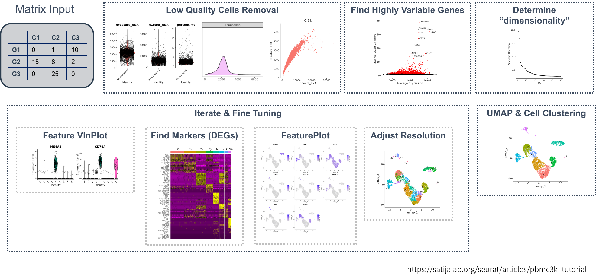

```{r, include = FALSE}
knitr::opts_chunk$set(
  collapse = TRUE,
  comment = "#>"
)
```

## The Standard Seurat Single Cell Analysis Workflow

`scSpotlight` uses the Seurat standard single cell analysis workflow, we recommend
new users going through their [pbmc3k tutorial](https://satijalab.org/seurat/articles/pbmc3k_tutorial) 
to better understand each processing step. The demonstration dataset used is a 2,700 
Peripheral Blood Mononuclear Cells (PBMCs) sample made publicly available by 10X Genomics. 
The matrix could be downloaded [here](https://cf.10xgenomics.com/samples/cell/pbmc3k/pbmc3k_filtered_gene_bc_matrices.tar.gz)

A typical seurat analysis workflow is like below:



## Invoke App

```{r setup, eval = FALSE}
library(scSpotlight)
```

To start using scSpotlight, please use the command below and access the app via: `127.0.0.1:8081`

```R
run_app(options = list(port = 8081, host = "0.0.0.0"))
```

The default mode of app is `processing`. User could also change mode to `viewer`, which will only allow illustrating
dataset and querying gene expressions:

```R
run_app(options = list(port = 8081, host = "0.0.0.0"), runningMode = "viewer")
```

If one needs to load a very large dataset, use `dataDir` parameter to mount data directory and load `Rds` file directly.

```R
run_app(options = list(port = 8081, host = "0.0.0.0"), runningMode = "viewer", dataDir = "/path/to/data_directory")
```

## Main Panel

Main panel of `scSpotlight` will be like:


## Input Files

Under the "processing" mode, `scSpotlight` supports compressed file containing typical 10X 
cellranger output ([Matrix Market Format](https://math.nist.gov/MatrixMarket/formats.html)):

```
$ tar -tvf PBMC_demo.tar.gz
drwxrwxr-x xzx/xzx           0 2024-01-11 21:11 PBMC_demo/
-rw-r--r-- xzx/xzx    67972057 2024-01-11 21:10 PBMC_demo/matrix.mtx.gz
-rw-r--r-- xzx/xzx      294722 2024-01-11 21:10 PBMC_demo/features.tsv.gz
-rw-r--r-- xzx/xzx       46443 2024-01-11 21:10 PBMC_demo/barcodes.tsv.gz
```

and processed Seurat object `seurat_processed.Rds` saved by [Seurat::SaveSeuratRds()].

## Filter Cells

